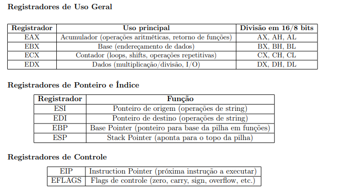
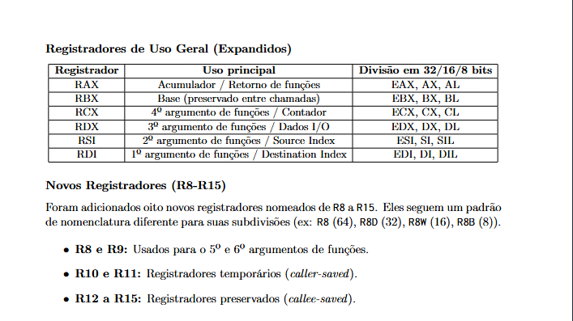

# Software Básico - CEFET/RJ
> Data: 09/09/2026

Esse documento está sendo montado para o estudo da matéria Software Básico, disciplina do terceiro período no curso de Engenharia da Computação no Centro Federal de Ensino Tecnológico Celso Suckow da Fonseca

## Matérias abordadas em sala (P1)

- Complemento a 2
- Ponto flutuante IEEE 754
- Tipos de Assembly
- Assembly Intel 32 bits
- Assembly Intel 64 bits
- Assembly ARM

Esse documento fará uma separação temporal entre os períodos inter-processuais, uma vez que, o mesmo será utilizado como objeto de estudo.

## Complemento a 2

### Como Funciona?

O dígito mais à esquerda (o mais significativo, ou MSB) indica o sinal do número (0: positivo; 1: negativo).

Entende-se que o conceito dessa metodologia tem como finalidade buscar o inverso do número estudado (Número * -1).
Para aplicar o conceito "Complemento a 2" em um número binário precisamos entender o funcionamento do seu algoritmo:

Número estudado [01110100] -> representa 116

Para achar o inverso desse número, devemos aplicar a seguinte fórmula:
**CPL2 = CPL1 + 1**; 
onde:
* CPL2 = inverso do número base;
* CPL1 = Número base onde 1 -> 0 e 0 -> 1
exs:
- CPL1(01110100) = 10001011
- CPL1(101) = 010

Para solucionar essa equação, é fundamental lembrar como funciona a soma em números binários:
* 0 + 0 = 0
* 1 + 0 = 1
* 0 + 1 = 1
* 1 + 1 = 10 (0 e "sobe" 1)

Solucionando: 
CPL2(01110100) = 10001011 + 1 
CLP2 = 10001100  -> representa -116
* perceba o 1 no início do número

DICA:
Ao aplicar o complemento a 2 duas vezes [CLP2(CLP2(x))], deve-se retornar o número original. Usando o exemplo acima:
CLP2 = CLP1 + 1
CLP2 = 01110011 + 1
CLP2 = 01110100
Serve como prova real.


### Aritmética e Detecção de Overflow

Exemplo: 5 + (-5) com 6 bits:

5 = 000101
-5 = 111011
soma: 000101 + 111011 = 1000000

O resultado tem 7 bits, mas como trabalhamos com 6, podemos descartar o bit mais a esquerda, então:

Resultado final: 000000 = 0 

Overflow ocorre quando o resultado de uma soma ultrapassa a faixa de valores representável pela quantidade de bits disponível.

Exemplo do livro: 40 + 60 com 7 bits:
40 = 0101000
60 = 0111100
soma  = 1100100  -> número negativo
Isso é overflow, quandoi somamos dois números positivos e o resultado aparece como negativo, o valor real (100) não cabe em 7 bits com sinal

Resumo:
Bit de sinal: O dígito mais à esquerda (o mais significativo, ou MSB) indica o sinal do número.
0 -> positivo
1 -> negativo
Fórmula para cálculo: 
CPL2 = CPL1 + 1

## Ponto Flutuante IEEE 754

### Como Funciona?

O número é dividido em três campos consecutivos de bits: Sinal, Expoente e Mantissa. Na precisão simples (32 bits), a distribuição é:

Sinal (S): 1 bit (bit 31)
Expoente (E): 8 bits (bits 30 a 23)
Mantissa (M): 23 bits (bits 22 a 0)

Entende-se que essa metodologia tem como finalidade representar faixas de valores muito grandes ou muito pequenas usando a mesma ideia da notação científica, só que em binário.

Como entender  seu algoritmo:

Número estudado [1 10000001 01101000000000000000000] -> representa -5,625

Para decodificar esse número, devemos entender que:

[1 10000001 01101000000000000000000]

1 = bit de sinal (nesse caso, negativo);
10000001 = expoente armazenado (antes de excluir o bias);
01101000000000000000000 = bits da mantissa (a parte que vem depois da vírgula);
bias =  é o numero que deve ser subtraído do expoente, nesse sistema ele é sempre 127

* ex:

Expoente armazenado 10000001 (=129) -> expoente real = 129 - 127 = 2

Para entender essa metodologia, é fundamental lembrar que todo número normalizado em binário começa com "1," (bit implícito, não armazenado):

1011,01 (binário) = 1,01101 x 2³

Solucionando (exemplo acima):

S = 1 -> negativo
E = 10000001 = 129 -> expoente real = 2 (porque, expoente - bias)
M = 01101000... -> com o bit implícito: 1,01101

Valor = -1 x 1,01101 x 2² -> Valor = -101,101₂ Valor = -5,625  

* IMPORTANTE!
Por que -101,101₂ é igual a -5,625 em decimal?
101 em binario decodificamos da seguinte forma:
(1 * 2²) + (0 * 2¹) + (1 * 2⁰) = 5
Porém, quando tratamos com números depois da vírgula, usamos expoentes negativos em formato crescente, assim:
(1 *2⁻¹) + (0 * 2⁻²) + (1 * 2⁻³) -> (1 *0,5) + (0) + (1 * 0,125) = 0,625

ou seja, a ordem é:
(a * 2²) + (b * 2¹) + (c * 2⁰) + (d *2⁻¹) + (e * 2⁻²) + (f * 2⁻³)
                               ^
                               |
                            vírgula

perceba o 1 no início (bit de sinal) indicando número negativo

## Conversão de Decimal para IEEE 754 (caminho inverso)

No documento acima, é exemplificado como decodificar um número IEEE 754 (binário -> decimal). Mas pode ser relevante entender o processo contrário, que se baseia em 5 passos:

* Determine o sinal S (0 positivo, 1 negativo)
* Converter o valor absoluto |x| para binário
* Normalize a mantissa para a forma (1,mantissa) 
* Calcule o expoente real conforme a quantidade de casas movidas e somar o bias: Exp armazenado = Exp real + 127
* Arredondar a mantissa para os 23 bits disponíveis

ex:
Converter -13,625 
Passo 1: Sinal
S = 1
Passo 2: Valor em binário
13 = 1101
0,625 = 0,101
13,625 = 1101,101
Passo 3: Mover a vírgula até normalizar 
1,101101
Passo 4: Calcular o expoente
Exp Real = 3 (moveu 3 casas)
Exp armazenado = 130 (127 + 3)
Passo 5: Mantissa 
M = 101101
M real = 10110100000000000000000

Resumo:
Bit de sinal: 
O dígito mais à esquerda (o mais significativo, ou MSB) indica o sinal do número. (0 -> positivo 1 -> negativo)
Fórmula para cálculo: Valor = (-1)^S × 1,M × 2^(E - 127)

Observação: a precisão dupla (64 bits) segue a mesma lógica, mudando apenas o tamanho dos campos: 1 bit de sinal + 11 bits de expoente (bias 1023) + 52 bits de mantissa.

## Tipos de Assembly

## Resumo sobre Assembly
Assembly é uma linguagem de baixo nível, ou seja, se comunica com o processador diretamente da forma que ele entende. O Assembly associa instruções em formato de texto a comandos de maquina em uma linguagem que o computador consegue entender (0 e 1)

* ex:
em Assembly: MOV AL, 0x61 é associado a 10110000 01100001

Por isso o Assembly é chamado de linguagem de baixo nível, isso é o mais próximo que a programação chega do hardware.
### Por que varias versões?

Assembly não é uma linguagem única e universal (ex: Python, JavaScript). Ele se diferencia conforme a melhor otimização para cada processador. Ou seja, cada família de processador entedne melhor um Assembly diferente.

Essa diferença existe pois cada versão do Assembly entende um conjunto diferente de instruções. O conjunto de instruções que um processador é capaz de executar se chama ISA (Set de arquitetura de instruções). Um processador Intel e um processador ARM têm ISAs diferentes, como se fossem países e idiomas diferentes.

### O que é um registrador (!!!)

O registrador é uma pequena área de memória dentro do próprio processador, usada para guardar valores temporariamente enquanto uma instrução é executada.

A diferença de um registrador para uma memória RAM é velocidade de acesso, é como se o registrador fosse o bolso de um agente de escritório(CPU) e a memória RAM fosse um armário distante, os registradores cabem apenas alguns bytes mas são muito mais rápidos. Eles podem ser divididos em registradores de uso geral, específicos e de segmento.

#### Tipos de registrador



### Modelos de Organização

Imagine a seguinte operação matemática: z = (x + y) * w
Existem 4 modelos clássicos do Assembly que solucionam essa operação de formas diferentes:

#### Stack Machine

```assembly
PUSH x, PUSH y, ADD, PUSH w, MUL
```
Não existem registradores visíveis, todas as operações acontecem em um formato de pilha, executando as operações na ordem em que aparecem.

#### Acumulador 

```assembly
LOAD x, ADD y, MUL w, STORE z
```
Existe UM registrador especial (ACC) que guarda o resultado de cada operação.

Reduz o número de operandos por instrução, mas é mais devagar por depender de um único registrador.

#### Register-Memory
```assembly
LOAD R1, x
ADD R1, y
MUL R1, w
STORE z, R1
```

As instruções podem operar tanto entre registradores quanto diretamente entre registrador e memória, mais flexível, porém mais complexo. Foi o modelo usado no x86 clássico.

#### Load/store (arquitetura RISC)

LOAD R1, x
LOAD R2, y
ADD  R3, R1, R2
LOAD R4, w
MUL  R5, R3, R4
STORE z, R5

Todas as operações aritméticas acontecem apenas entre registradores, a memória só é acessada por instruções explícitas de LOAD e STORE.

### Considerações 

* Stack Machine: simples, mas com maior sobrecarga de acessos. 
* Acumulador: reduz operandos, mas depende de um único registrador. 
* Register-Memory: flexível, mas com instruções mais complexas. 
* Load/Store: separa memória e registradores, otimizando desempenho em arquiteturas modernas.

### Assembly Intel 32 bits (x86)

Essa é a arquitetura clássica, usada até o início dos anos 2000 em PCs comuns. Os registradores (as "gavetas" onde a CPU guarda dados temporariamente) têm 32 bits de largura. Isso limita o processador a endereçar diretamente até 4 GB de memória RAM (2³²), o que hoje é uma limitação real. Ainda é relevante para entender fundamentos, rodar softwares legados e para quem estuda engenharia reversa de sistemas antigos.

### Assembly Intel 64 bits (x86-64 / AMD64)

É a evolução natural do x86, criada para superar o limite de memória do modo 32 bits. Os registradores dobrma de tamanho e a arquitetura ganha registradores extras (R8 a R15), permitindo mais dados manipulados por instrução e endereçamento de memória maior. É o padrão dominante em notebooks e computadores atuais (usados por Intel e AMD). Um detalhe minimamente interessante para o mercado de trabalho: existe retrocompatibilidade, um processador 64 bits ainda consegue rodar código 32 bits, o que abre algumas portas.

### Assembly ARM

Possui uma filosofia de arquitetura diferente. Enquanto a versão de 64 bits é CISC (Complex Instruction Set Computer, instruções complexas e assíncronas), ARM é RISC (Reduced Instruction Set Computer, instruções simples executadas em menos "ciclos"). Isso faz ele mais eficiente em consumo de energia.

* Professor ressaltou na revisão sobre a eficiencia de energia e sobre a utilidade desse sistema para a economia de energia em smartphones e tablets atuais

## Codificação em Assembly para 32 bits

Um programa em Assembly Intel geralmente é organizado em três seções principais:

#### .data
Momento do código em que definimos nossos dados (Variáveis globais com algum valor inicial)

#### .bss
Momento do código em que reservamos espaço para nossos dados, sem definir um valor inicial (variáveis globais sem valor, ou com valor igual a zero).

#### .text
seção de código, onde ficam as instruções do programa


* ex:
```assembly
section .data
    ; Dados com um valor conhecido em tempo de compilação
    msg:      db "Ola Mundo", 0xA   ; texto + quebra de linha (0xA -> \n em C)
    msg_len:  equ $ - msg           ; método que calcula o tamanho da string automaticamente
 
section .bss
    ; Dados reservados, mas SEM valor inicial (só o espaço é separado)
    buffer:   resb 64               ; reserva 64 bytes, ainda vazios/lixo de memóriam, para a entrada do usuario
 
section .text 
    global _start                    ; avisa para começar a rodar por aqui
 
_start:
    ; Chamada de sistema WRITE (escreve msg na tela)
    mov eax, 4          ; código da syscall "write"
    mov ebx, 1           ; destino: 1 = saída padrão (stdout)
    mov ecx, msg         ; endereço do dado que queremos escrever
    mov edx, msg_len      ; quantos bytes escrever
    int 0x80             ; aciona a interrupção -> pede ajuda ao kernel
 
  
    ; Chamada de sistema READ (lê algo do teclado e guarda em 'buffer')
    mov eax, 3           ; código da syscall "read"
    mov ebx, 0           ; origem: 0 = entrada padrão (stdin)
    mov ecx, buffer       ; endereço onde vamos GUARDAR o que for lido
    mov edx, 64           ; quantos bytes no máximo ler
    int 0x80
 
    ; --- Encerrando o programa ---
    mov eax, 1            ; código da syscall "exit"
    mov ebx, 0            ; código de saída = 0 (sucesso)
    int 0x80
```

### Estruturas de sintaxe básicas para 32 bits

#### MOV 
Transferência de dados

```assembly
mov eax, ebx 
```
(copia o conteúdo de EBX para EAX)

#### ADD / SUB
Soma e subtração

```assembly
add eax, 5
sub ebx, eax
```
(pega o valor que estava em eax e soma 5)
(pega o valor que estava em ebx e subtrai o valor que estava em eax)

#### MUL / IMUL
Multiplicação com e sem o bit de sinal

```assembly
imul eax, ebx
```
(essa linha faz eax = eax * ebx, considerando o bit de sinal)

#### DIV / IDIV
Divisão com e sem o bit de sinal

```assembly
idiv ebx
```
(essa linha faz edx:eax / ebx, considerando o bit de sinal.
Nesse caso, EAX recebe o resultado da divisão e EDX recebe o resto da divisão)

#### INC / DEC
incremento e decremento.

```assembly
inc ecx, dec eax
```
(ecx = ecx + 1
 eax = eax - 1)
(incremento e decremento padrão visto em PYTHO & JS como: i++ / i--) 

#### CMP
Comparação  (subtração lógica usada em jumps).

```assembly
cmp eax, ebx
```
(compara eax com ebx e atualiza uma flag com base no resultado coletado.)
Essa comparação pode receber diferentes flags conforme o resultado (Isso será relevante para o estudo de jumps)
ZF se  eax - ebx = 0 (eax = ebx)
SF se o resultado é negativo (MSB = 1)
CF se houver emprestimo na operação eax - ebx
OF se houver overflow

#### PUSH / POP
Manipulação da pilha, mexe na prioridade das operações

```assembly
push eax
pop ebx
```
(Pega o valor que está em EAX e o coloca no topo da pilha)
(Pega o valor que está em EBX e o coloca no fundo da pilha)

### ESTRUTURAS CONDICIONAIS (JUMPS, INSTRUÇÕES DE DESVIO)

* JMP (sempre desvia) -> Jump
* JE (if x===y) -> Jump if Equal
* JZ (if == 0)  -> Jump if zero
* JNE (x !== y) -> Jump if Not Equal
* JNZ (x !==0) -> Jump if Not Zero
* JG & JNLE (x > y) -> Jump if Greater & Jump if Not Less or Equal
* JL & JNGE (x < y) -> Jump if less & Jump if Not Greater or Equal
* JGE / JNL (x >= y) - Jump if Greater or Equal & Jump if Not Less
* JLE / JNG (x <= y) Jump if Less or Equal & Jump if Not Greater


> Exemplo de Loop com Jump:
```assembly
mov ecx, 5    ; associa 5 ao valor de ecx
loop_start:   ; inicia o loop
    dec ecx   ; implementa um decremento em ecx (i--)
    jnz loop_start; ; encerra quando ecx=0  
```


## Pilha (Stack)

A pilha (stack) é uma área de memória usada para armazenar dados temporários, variáveis locais e endereços de retorno de funções. Ela segue o modelo LIFO (Primeiro a entrar, último a sair).

### Conceitos importantes 

#### ESP
ESP (Stack Pointer) é um registrador especial que sempre aponta para o proximo item da pilha, ou seja, para o endereço de memória do último item empilhado.

Endereço alto   |         |
                |  valor2 |  <- ESP apontava aqui antes
                |  valor1 |  <- ESP aponta aqui agora (após um PUSH)
Endereço baixo  |         |

#### EBP
EBP (Base Pointer) marca um ponto fixo de referência dentro da pilha, geralmente o início do "espaço de trabalho" de uma função. Enquanto ESP fica se mexendo o tempo todo (a cada PUSH/POP), EBP fica parado durante a execução da função, servindo como referência estável para acessar variáveis locais e argumentos.


* Exemplo de Função com Stack:
```assembly
soma:      ; Função soma(a, b)
    push ebp    ; guarda o ebp antigo na pilha, antes de sobrescrever
    mov ebp, esp  ; atribui o valor de esp a ebp
    mov eax, [ebp+8]    ; pega o primeiro argumento (a) e guarda em eax 
    add eax, [ebp+12]   ; soma o segundo argumento (b) a eax
    pop ebp   ;restaura o ebp antigo, tirando da pilha
    ret  ;volta para quem chamou a função
; Chamada da função
mov eax, 4  ; atribui o valor 4 a eax
mov ebx, 6  ; atribui o valor 6 a ebx
push eax    ; empurra o valor de eax para o proximo item da pilha
push ebx    ; empurra o valor de ebx para o proximo item da pilha, por cima de eax
call soma   ; chama a função soma
add esp, 8  ; libera o espaço que os 2 argumentos ocupavam na pilha
```

## Codificação em Assembly para 64 bits
O Assembly Intel 64 bits (x86-64) é a evolução da arquitetura IA-32. Além da expansão do barramento de endereços, ela introduz mais registradores (principal) e uma nova convenção de chamada que otimiza significativamente a performance

### Registradores
No x86-64, os registradores de uso geral foram expandidos para 64 bits (prefixo R). Além disso, o número de registradores de uso geral dobrou, indo de 8 para 16.

#### Tipos de registro:




### Gestão de pilha e chamadas

O modelo de 64 bits não usa o antigo modelo de argumentos via pilha, os primeiros 6 argumentos da função são passasdo via registradores (RDI, RSI, RDX, RCX, R8, R9) para otimizar o processo, um sistema muito mais simples de entender.

```assembly 

soma:   ; Função soma(a, b) -> rdi=a, rsi=b
mov rax, rdi ; atribui o valor de rdi para rax
add rax, rsi ; soma rsi com o valor em rax (a + b)
ret ; retorna o valor em rax (soma final)

; Chamada da função
mov rdi, 10 ; define rdi = a = 10
mov rsi, 20 ; define rsi = b = 20
call soma ; faz a chamada da função
```


